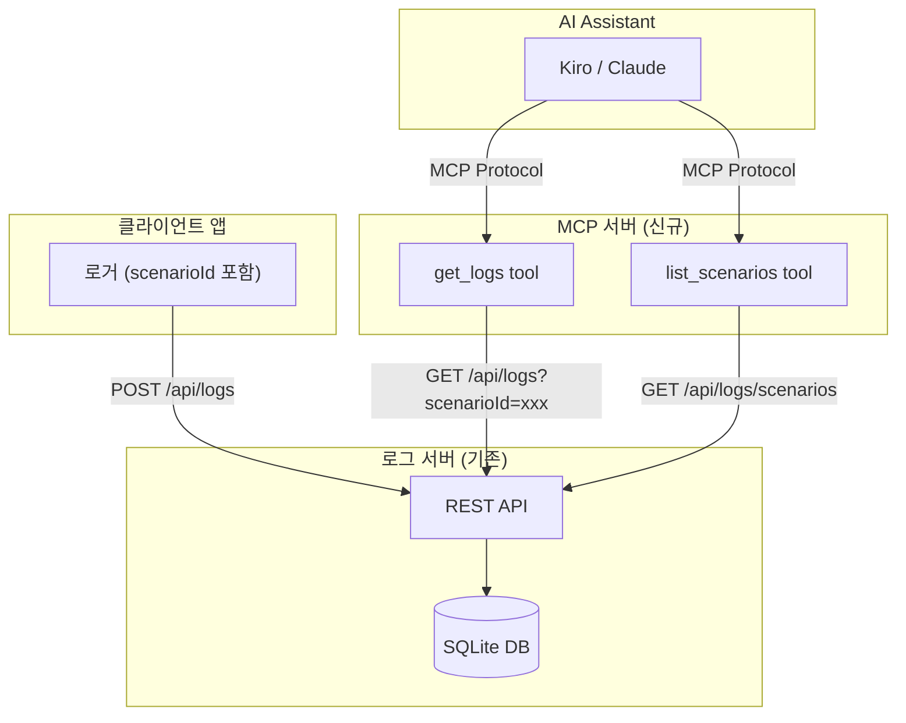

# Design Document: MCP Log Server Integration

## Overview

이 기능은 AI가 MCP(Model Context Protocol)를 통해 로그 서버와 직접 통신하여 시나리오 기반으로 로그를 조회하고 분석할 수 있도록 합니다. 

핵심 구성요소:
1. **로그 서버 확장** - 기존 로그 서버에 scenarioId 필드 추가 및 시나리오 기반 조회 API
2. **MCP 서버** - AI가 호출할 수 있는 `get_logs`, `list_scenarios` 도구 제공
3. **클라이언트 로거 수정** - LogPayload에 scenarioId 필드 추가

## Architecture



## Components and Interfaces

### 1. 로그 서버 API 확장

#### 1.1 로그 저장 (기존 POST /api/logs 수정)

```typescript
// 요청 스키마 확장
const logSchema = z.object({
  level: z.string().min(1),
  label: z.string().min(1),
  message: z.string().min(1),
  context: z.any().optional(),
  timestamp: timestampSchema,
  source: z.string().optional(),
  scenarioId: z.string()
    .max(100)
    .regex(/^[a-zA-Z0-9_-]+$/)
    .optional(),  // 신규 필드
});
```

#### 1.2 로그 조회 (GET /api/logs 확장)

```typescript
// 쿼리 파라미터 확장
const listSchema = z.object({
  // 기존 파라미터...
  scenarioId: z.string().optional(),  // 신규 파라미터
});

// 응답 형식
interface LogListResponse {
  items: LogRecord[];
  nextCursor?: string;
  hasMore: boolean;  // 신규 필드
}
```

#### 1.3 시나리오 목록 조회 (신규 GET /api/logs/scenarios)

```typescript
// 쿼리 파라미터
const scenarioListSchema = z.object({
  limit: z.string()
    .optional()
    .transform((v) => (v ? Number(v) : 20))  // 기본값 20
    .pipe(z.number().int().min(1).max(100)),
});

// 응답 형식
interface ScenarioListResponse {
  scenarios: {
    scenarioId: string;
    logCount: number;
    firstLogAt: string;
    lastLogAt: string;
    levels: string[];  // 해당 시나리오의 로그 레벨 목록
  }[];
}
```

### 2. MCP 서버

#### 2.1 서버 구조

```typescript
// mcp-server/src/index.ts
import { McpServer } from "@modelcontextprotocol/sdk/server/mcp.js";
import { StdioServerTransport } from "@modelcontextprotocol/sdk/server/stdio.js";
import { z } from "zod";

const server = new McpServer({
  name: "poslog-mcp",
  version: "1.0.0",
});
```

#### 2.2 get_logs 도구

```typescript
server.tool(
  "get_logs",
  "시나리오 ID로 로그를 조회합니다",
  {
    scenarioId: z.string().describe("조회할 시나리오 ID (필수)"),
    limit: z.number().optional().describe("최대 반환 개수 (기본: 100, 최대: 500)"),
    level: z.string().optional().describe("로그 레벨 필터 (DEBUG, INFO, WARN, ERROR)"),
  },
  async ({ scenarioId, limit, level }) => {
    // limit은 최대 500으로 클램프
    // 로그 서버 API 호출 및 결과 포맷팅
    // 응답이 100개 초과 시 hasMore=true 포함
  }
);
```

#### 2.3 list_scenarios 도구

```typescript
server.tool(
  "list_scenarios",
  "최근 시나리오 목록을 조회합니다",
  {
    limit: z.number().optional().describe("최대 반환 개수 (기본: 20, 최대: 100)"),
  },
  async ({ limit }) => {
    // 시나리오 목록 API 호출 및 결과 포맷팅
    // lastLogAt 기준 내림차순 정렬
  }
);
```

### 3. 클라이언트 로거 타입 확장

```typescript
// LogPayload 타입 확장
export type LogPayload = {
  level: LogLevel;
  message: string;
  label?: string;
  context?: LogContext;
  source?: string;
  timestamp?: string;
  endpoint?: string;
  scenarioId?: string;  // 신규 필드
};
```

## Data Models

### 데이터베이스 스키마 변경

```sql
-- 기존 logs 테이블에 scenario_id 컬럼 추가
ALTER TABLE logs ADD COLUMN scenario_id TEXT;

-- 인덱스 추가
CREATE INDEX IF NOT EXISTS idx_logs_scenario_id ON logs(scenario_id);
```

### LogRecord 타입 확장

```typescript
export type LogRecord = {
  id: number;
  level: string;
  label: string;
  message: string;
  context: string | null;
  timestamp: string;
  source: string | null;
  scenario_id: string | null;  // 신규 필드
  created_at: string;
};

export type InsertLog = {
  level: string;
  label: string;
  message: string;
  context?: unknown;
  timestamp?: string;
  source?: string;
  scenarioId?: string;  // 신규 필드
};
```


## Correctness Properties

*A property is a characteristic or behavior that should hold true across all valid executions of a system-essentially, a formal statement about what the system should do. Properties serve as the bridge between human-readable specifications and machine-verifiable correctness guarantees.*

Based on the prework analysis, the following properties have been identified. Redundant properties have been consolidated where one property implies another.

### Property 1: Scenario ID Round Trip
*For any* log entry with a valid scenario ID, inserting the log and then querying by that scenario ID should return the original log with the scenario ID preserved.
**Validates: Requirements 1.1, 1.2**

### Property 2: Scenario ID Filtering Correctness
*For any* set of logs with various scenario IDs, querying with a specific scenarioId parameter should return only logs where the scenario_id field exactly matches the query parameter.
**Validates: Requirements 2.1**

### Property 3: Combined Filter Correctness
*For any* query with both scenarioId and level parameters, all returned logs should satisfy both conditions (matching scenarioId AND matching level).
**Validates: Requirements 2.2**

### Property 4: Limit Constraint
*For any* query with a limit parameter, the number of returned items should be less than or equal to the specified limit, and when more items exist, hasMore should be true.
**Validates: Requirements 2.3, 2.4**

### Property 5: Scenario List Accuracy
*For any* set of logs, the scenarios endpoint should return correct aggregations: logCount should equal the actual count of logs for that scenarioId, and time ranges should match the actual first and last log timestamps.
**Validates: Requirements 3.1**

### Property 6: Scenario List Ordering
*For any* scenarios list response, scenarios should be ordered by lastLogAt in descending order (most recent first).
**Validates: Requirements 3.2**

### Property 7: MCP Tool Response Format
*For any* invocation of the get_logs tool with a valid scenarioId, the response should contain formatted text with all log entries for that scenario.
**Validates: Requirements 4.2**

### Property 8: Authentication Header Inclusion
*For any* request made by the MCP server to the Log Server, the request headers should include the configured API key.
**Validates: Requirements 5.2**

### Property 9: Invalid Auth Rejection
*For any* request with a missing or invalid API key, the Log Server should return a 401 status code.
**Validates: Requirements 5.3**

### Property 10: Scenario ID Validation
*For any* scenario ID containing characters other than alphanumeric, hyphens, or underscores, the Log Server should reject the request with a 400 status code. Similarly, any scenario ID exceeding 100 characters should be rejected.
**Validates: Requirements 6.2, 6.3**

## MCP Server Logging Strategy

MCP STDIO 모드에서는 stdout이 JSON-RPC 메시지 전송에 사용되므로, 모든 로그는 stderr로만 출력해야 합니다.

```typescript
// ❌ 금지 - stdout 오염
console.log("Processing request");

// ✅ 허용 - stderr 사용
console.error("Processing request");

// 또는 로깅 라이브러리 사용 (stderr로 출력 설정)
import { createLogger } from './logger';
const logger = createLogger({ stream: process.stderr });
```

## Log Cleanup (TTL)

30일 이상 된 로그를 자동으로 정리하는 기능입니다.

```typescript
// server/src/db.ts
export const deleteOldLogs = (daysOld: number = 30): number => {
  const cutoffDate = new Date();
  cutoffDate.setDate(cutoffDate.getDate() - daysOld);
  
  const stmt = db.prepare(`
    DELETE FROM logs 
    WHERE created_at < @cutoff
  `);
  
  const info = stmt.run({ cutoff: cutoffDate.toISOString() });
  return info.changes;
};

// 서버 시작 시 일일 정리 스케줄링
const scheduleCleanup = () => {
  // 매일 자정에 실행
  setInterval(() => {
    const deleted = deleteOldLogs(30);
    console.error(`[Cleanup] Deleted ${deleted} old log entries`);
  }, 24 * 60 * 60 * 1000);
};
```

## Error Handling

### 로그 서버 에러 처리

| 상황 | HTTP 상태 | 응답 |
|------|----------|------|
| 유효하지 않은 scenarioId 형식 | 400 | `{ error: "Invalid scenarioId format" }` |
| scenarioId 길이 초과 (>100) | 400 | `{ error: "scenarioId exceeds maximum length" }` |
| 인증 실패 | 401 | `{ error: "Unauthorized" }` |
| 서버 내부 오류 | 500 | `{ error: "Internal server error" }` |

### MCP 서버 에러 처리

| 상황 | 처리 방식 |
|------|----------|
| 로그 서버 연결 실패 | 에러 메시지를 text content로 반환 |
| 인증 실패 | 에러 메시지와 함께 설정 확인 안내 반환 |
| 잘못된 파라미터 | Zod 검증 에러 메시지 반환 |

## Testing Strategy

### 테스트 프레임워크

- **단위 테스트**: Vitest
- **Property-Based Testing**: fast-check
- **통합 테스트**: Supertest (API 테스트)

### 단위 테스트

1. **DB 함수 테스트**
   - `insertLog` with scenarioId
   - `listLogs` with scenarioId filter
   - `listScenarios` aggregation

2. **API 라우트 테스트**
   - scenarioId 파라미터 검증
   - 응답 형식 검증

3. **MCP 도구 테스트**
   - `get_logs` 도구 응답 포맷
   - `list_scenarios` 도구 응답 포맷

### Property-Based Testing

Property-based 테스트는 fast-check 라이브러리를 사용하여 구현합니다. 각 테스트는 최소 100회 반복 실행됩니다.

테스트 파일에는 다음 형식의 주석으로 검증하는 속성을 명시합니다:
```typescript
// **Feature: mcp-log-integration, Property 1: Scenario ID Round Trip**
```

주요 Property-Based 테스트:

1. **Property 1: Scenario ID Round Trip**
   - 임의의 유효한 scenarioId로 로그 삽입 후 조회하여 일치 확인

2. **Property 2: Scenario ID Filtering Correctness**
   - 다양한 scenarioId를 가진 로그 집합에서 필터링 정확성 검증

3. **Property 4: Limit Constraint**
   - 임의의 limit 값에 대해 반환 개수 제약 검증

4. **Property 10: Scenario ID Validation**
   - 임의의 잘못된 문자열에 대해 검증 로직 테스트

### 통합 테스트

1. **End-to-End 워크플로우**
   - 로그 삽입 → 시나리오 목록 조회 → 시나리오별 로그 조회

2. **MCP 서버 통합**
   - MCP 도구 호출 → 로그 서버 API 호출 → 응답 포맷팅
